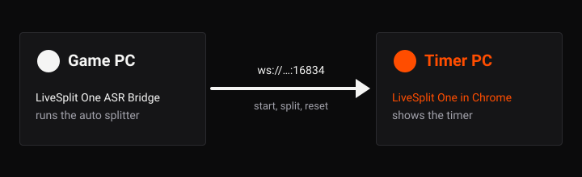

# LiveSplit One ASR Bridge

Run auto splitters here, control LiveSplit One anywhere.

LiveSplit One ASR Bridge runs a LiveSplit auto splitter (a `.wasm` file made for LiveSplit's Auto Splitting Runtime) on the PC your game runs on. LiveSplit One connects to it with its built-in **Connect to Server** option, and the app sends it start, split, reset and game time commands as the auto splitter decides.

It is made for two-PC setups: a gaming PC running the game, and a streaming PC showing the timer. It works with LiveSplit One in a Chrome-based browser. The original Windows LiveSplit isn't supported yet.

<!-- screenshot: S1 main-window.png -->
The main window with an auto splitter loaded, the Game card showing ATTACHED, the Timer card showing CONNECTED and a split in Last action.

## Start here

1. [Installing](Installing): download the app and open it the first time.
2. [Getting Started](Getting-Started): from first launch to your first split.

## More

- [Connecting LiveSplit One](Connecting-LiveSplit-One): which address to use, several timers, the port.
- [Auto Splitters and Settings](Auto-Splitters-and-Settings): open and reload auto splitters, game names, saving settings.
- [The Main Window](The-Main-Window): every card and state.
- [Logs and Files](Logs-and-Files): the log categories, and where files are kept.
- [Platform Notes](Platform-Notes): what each OS needs.
- [Troubleshooting](Troubleshooting): what you see, why, and what to do.
- [Upcoming Changes](Upcoming-Changes): documentation for changes not yet released.
